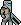
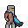
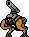
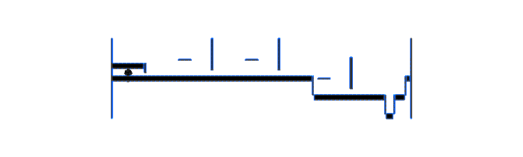

# 2dWF
## A 2D PvE shooter with random level generation and a diverse weapon collection
#### Perpetual Work In Progress  

## Features  
    
* 19 different and individual weapons  
    * 
* 4 different enemies with their own AI and fighting styles
    * 
    
    
    
* A Dog
    * 
* Full Animations for all characters
    *   
* Randomly generated levels with 5 different tiles
    * 
 
Sounds come from either  
https://www.warframe.com  
or  
https://8bitwarframe.itch.io/lost-sector
##Dependencies
1. Python 3 (I'm using 3.4 64bit)
  * https://www.python.org/downloads/
2. Pygame (use 64bit if you're using 64 bit python)
  * ```pip3 install pygame```
